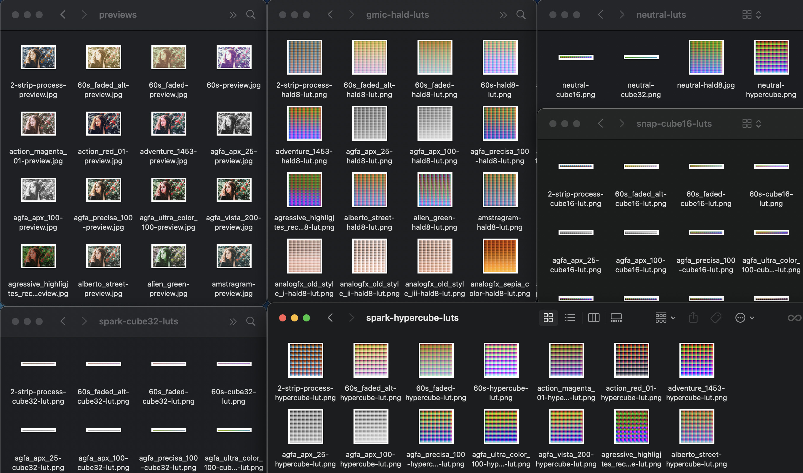
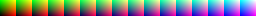
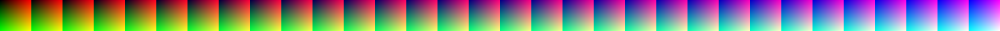
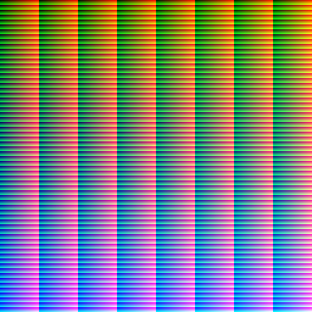
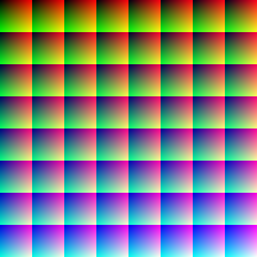

# GMIC LUTs

This project translates the built-in [GMIC LUTs](https://gmic.eu/color_presets/) to various formats, using a bash script. Preview images are generated for human eyes.

[Download the collection](https://drive.google.com/uc?export=download&id=1YN0Q-nrsw50A5-FgWNWaDvBMm2eyNpRG)

## Formats

### Cube16: Snapchat Lens Studio format

### Cube32: Spark AR native format

### Hald8: GMIC and ImageMagick format

### Hypercube: Spark AR FastColorLUT format (and common webgl)

## Usage

[Requires GMIC](https://gmic.eu/index.html)

Run `bash generate-luts.sh` on the command line. 

To change the preview image, replace test.jpg with your own image. 

Any image-based format can be supported just by adding a new neutral lut and editing the script. 
